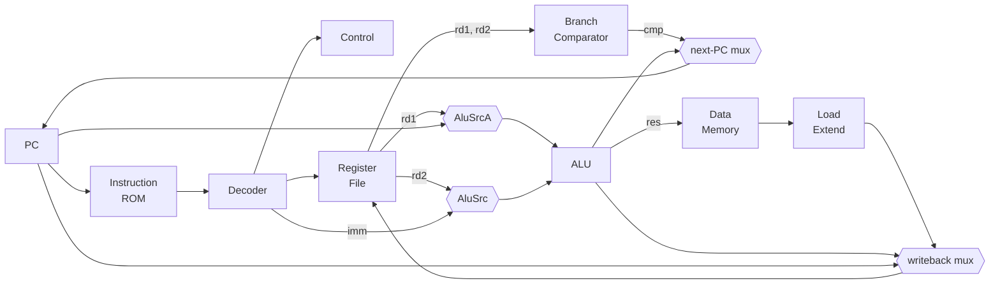

# RV32I "DOOMED" CPU

A 32-bit RISC-V processor written from scratch in SystemVerilog.

**Status:** 5-stage pipelined core — all 37 RV32I base integer instructions implemented and verified, 46/46 assertions passing at every padding level.
**Next:** toolchain → `riscv-tests` → memory map and framebuffer → run DOOM on it.

```
rtl/       12 SystemVerilog modules — the processor
verif/     self-checking test harness (Python assembler + generator + testbenches)
results/   archived pass/fail tables, one per padding level
docs/      architecture reference, test plan, status and roadmap
```

---

## What it implements

All 37 base integer instructions, across all six RISC-V encoding formats:

| format | count | instructions |
|---|---|---|
| **R-type** | 10 | `ADD` `SUB` `SLL` `SLT` `SLTU` `XOR` `SRL` `SRA` `OR` `AND` |
| **I-type** | 15 | `ADDI` `SLTI` `SLTIU` `XORI` `ORI` `ANDI` `SLLI` `SRLI` `SRAI` `LB` `LH` `LW` `LBU` `LHU` `JALR` |
| **S-type** | 3 | `SB` `SH` `SW` |
| **B-type** | 6 | `BEQ` `BNE` `BLT` `BGE` `BLTU` `BGEU` |
| **U-type** | 2 | `LUI` `AUIPC` |
| **J-type** | 1 | `JAL` |

`FENCE` decodes to a no-op, which is spec-correct on a single-core in-order machine with no caches.
`ECALL` / `EBREAK` are not implemented — they require CSRs and trap handling, which arrive alongside `riscv-tests`.

---

## Datapath



**Next-PC select** is the 2-bit field `{Branch, Jump}`:

| `{Branch,Jump}` | next PC | instructions |
|---|---|---|
| `00` | `PC + 4` | sequential |
| `01` | `ALU result` (`PC + imm`) | `JAL` |
| `10` | `cmp ? ALU result : PC + 4` | B-type |
| `11` | `ALU result & ~1` | `JALR` |

**Writeback select:** `MemToReg` → load data, else `Jump` → `PC + 4`, else ALU result.

### Pipeline

Five stages — IF, ID, EX, MEM, WB — with four pipeline registers. Control signals
ride the registers alongside their instruction, which is why `control.sv` needed
no changes when the core was pipelined.

| hazard | handled by |
|---|---|
| RAW at distance 1 | EX/MEM→EX forwarding |
| RAW at distance 2 | MEM/WB→EX forwarding |
| RAW at distance 3 | write-first register file |
| load-use | one-cycle interlock: freeze PC and IF/ID, bubble ID/EX |
| taken branch or jump | flush IF/ID and ID/EX (branches resolve in EX) |

When both forwarding paths match, EX/MEM wins — it holds the more recent write.

---

## Design decisions

**One ALU for every PC-relative target.** `JAL`, branches, and `AUIPC` all need `PC + imm`. Rather than add a dedicated branch-target adder, a single `AluSrcA` bit steers `PC` onto the ALU's A input. The ALU is idle on branches anyway — the comparison is a separate unit — so the adder would have been redundant hardware. Only `PC + 4` gets its own adder, because `JAL`/`JALR` need the target and the link value in the same cycle.

**`AluSrcA` is the only bit distinguishing `LUI` from `AUIPC`.** Every other control signal is identical between them: `LUI` computes `0 + imm`, `AUIPC` computes `PC + imm`.

**`LUI` costs no extra hardware.** The decoder leaves `rs1 = x0` for U-type and J-type instructions, and `x0` is hardwired zero, so the ALU produces `0 + imm` with no special case. The same default also prevents J/U-type instructions from reading a garbage register out of immediate bits that happen to sit in `instruction[19:15]`.

**Writeback needs no dedicated selector.** `Jump` is high for exactly `JAL` and `JALR` — precisely the two instructions whose `rd` receives `PC + 4` — so the existing signal does the job a wider mux select would have.

**Control is pure instruction decode.** It receives only `opcode`, `funct3`, and `funct7`, never datapath values. The branch comparator is a separate module for this reason, and it keeps control signals cleanly pipelineable.

Result: **9 control signals** total.

---

## Modules

| file | module | role |
|---|---|---|
| `rtl/top.sv` | `top_wire` | stage wiring, pipeline registers, muxes, flush |
| `rtl/PC.sv` | `PrgCo` | program counter |
| `rtl/ROM.sv` | `ROME` | instruction memory |
| `rtl/decoder.sv` | `decoder` | field extraction, immediate reassembly |
| `rtl/control.sv` | `control` | opcode → control signals |
| `rtl/registers.sv` | `registers` | 32×32 register file, `x0` write-guarded |
| `rtl/ALU.sv` | `ALU` | 10 operations, `{funct7[5], funct3}` encoded |
| `rtl/cmp.sv` | `comparator` | branch condition, signed/unsigned |
| `rtl/data_mem.sv` | `memory` | byte/halfword/word access, misalignment guards |
| `rtl/load_extend.sv` | `load_extend` | byte-lane select + sign/zero extension |
| `rtl/forward.sv` | `forward` | EX/MEM→EX and MEM/WB→EX operand bypass |
| `rtl/hazard.sv` | `hazard` | load-use interlock |

---

## Verification

`verif/` contains a self-checking harness built from scratch:

| file | purpose |
|---|---|
| `asm.py` | RV32I assembler — encoders for all six instruction formats |
| `gen_test.py` | generates a 114-instruction test program + expected register/memory state |
| `gen_demo.py` | generates a short, readable 30-instruction demo for waveform viewing |
| `tb_check.sv` | runs to completion, dumps all registers and memory |
| `tb_wave.sv` | same, plus VCD output and a per-instruction commit log |
| `check.py` | diffs simulator state against expectations |
| `run.sh` | the whole loop in one command |
| `run_wave.sh` | builds the demo program and emits `wave.vcd` |

```sh
cd verif && sh run.sh
```

```
checked 46 values, 0 failures
```

### Coverage

- Every one of the 37 instructions executed and its result checked
- All six branch comparisons, **both** taken and correctly not-taken
- Byte placement verified at all four lane offsets — `0x12345678` written by four `SB`s and read back one byte at a time
- Signed vs unsigned comparison (`-1 < 5` is true signed, false unsigned)
- `SRA` vs `SRL` on identical operands, confirming the `{funct7[5], funct3}` decode
- Sign vs zero extension: `LB` and `LBU` on the same byte return `0xFFFFFFFF` and `0x000000FF`

### Edge cases

- `x0` remains zero when written to
- Shift amounts ≥ 32 use only the low 5 bits
- **Backward branches** — negative B-type offsets, verified with a 3-iteration loop
- **`JALR` clears bit 0** of its computed target — verified by landing on an address that would be odd if the mask were missing

---

## Running it

Requires [Icarus Verilog](https://steveicarus.github.io/iverilog/) and Python 3.

**Full verification:**
```sh
cd verif && sh run.sh
```

**Waveform demo** (30-instruction program, retires at 325 ns):
```sh
cd test
python gen_demo.py
iverilog -g2012 -o demo.vvp ROM_demo.sv tb_wave.sv \
    ../ALU.sv ../PC.sv ../control.sv ../cmp.sv \
    ../data_mem.sv ../decoder.sv ../registers.sv ../top.sv
vvp demo.vvp
gtkwave wave.vcd
```

Signals worth watching: `PC_loc`, `IR_loc`, `OpA_loc`, `OpB_loc`, `res_loc`, `cmp_loc`, `next_PC_loc`, `wd_loc`.

---

## Roadmap

- [x] Single-cycle RV32I core
- [x] Sub-word loads and stores with sign/zero extension
- [x] Self-checking test harness — 46/46
- [x] 5-stage pipeline: forwarding, load-use interlock, branch flush
- [ ] Toolchain: `riscv-none-elf-gcc`, linker script, hex conversion
- [ ] `ECALL` / `EBREAK` + minimal CSRs
- [ ] `riscv-tests` — 40/40 `rv32ui`
- [ ] Differential co-simulation against Spike
- [ ] M extension (`MUL` / `DIV`)
- [ ] Memory map, framebuffer, timer, keyboard
- [ ] Run a game on it
- [ ] Run DOOM on it

See [`docs/STATUS.md`](docs/STATUS.md) for the full roadmap and the reasoning behind the order.
